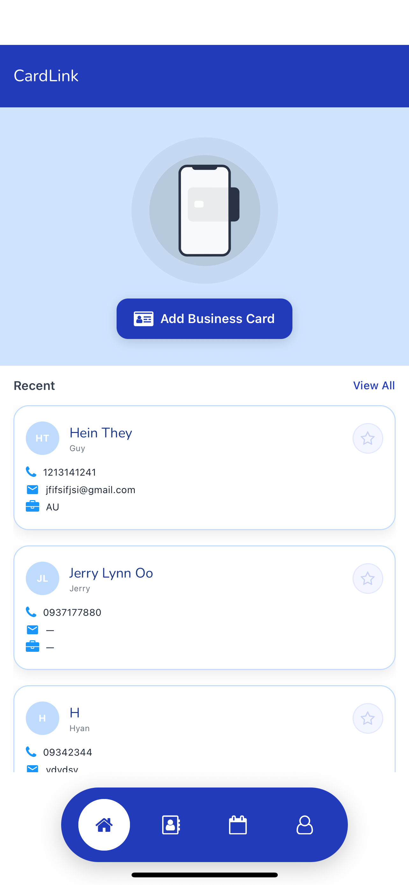
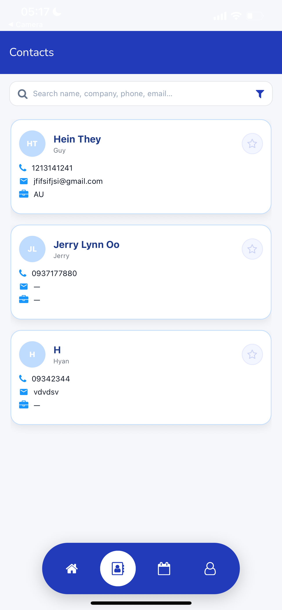
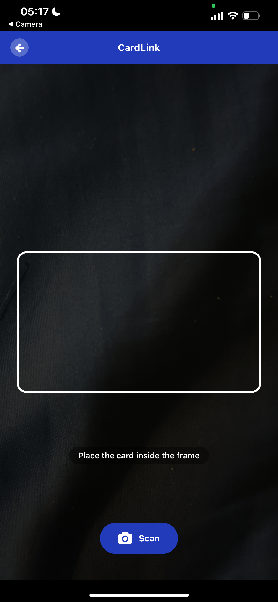

# 🐰🥕 SP1 | CardLink — Hyan Version  

Business card scanning & management app built as my **Senior Project 1**.  
Powered by **React Native (Expo)**, **Node.js / Express**, **MongoDB**, and **Cloudinary**.  

---

## 🐰 Features
- 🥕 Capture business cards with camera  
- 🥕 OCR + NLP for accurate field extraction  
- 🥕 Organize, search, and favorite contacts  
- 🥕 Cloud image storage with Cloudinary  
- 🥕 Secure token-based authentication  

---

## 🐰 Screenshots

<table>
  <tr>
    <th> Splash</th>
    <th> Home</th>
    <th> Contacts</th>
    <th> Scan</th>
  </tr>
  <tr>
    <td></td>
    <td></td>
    <td></td>
    <td></td>
  </tr>
</table>

---

## 🐰 Tech Stack
- **Frontend**: React Native (Expo, Tailwind, Lottie, Expo Router)  
- **Backend**: Node.js + Express  
- **Database**: MongoDB (Mongoose)  
- **Cloud**: Cloudinary (image storage)  
- **Auth**: SecureStore + JWT  

---

## 🐰 About Me
Hi! I’m **Hein Htet Moe Tun (Hyan)** ✨  
This repo is my senior project submission — part academic, part portfolio, part fun.  
I love blending **clean design** with a touch of 🐰 kawai energy 🥕.  

---

## 🐰 How to Run
```bash
# clone repo
git clone https://github.com/heinhtetmoetun/SP1-CardLink

# install deps
cd sp1-cardlink-hyan
npm install

#install modules
do not forget to install modules ^^
npm install \
expo-router \
nativewind react-native-safe-area-context react-native-gesture-handler react-native-reanimated \
react-native-vector-icons @expo/vector-icons \
expo-camera expo-image-manipulator expo-file-system expo-secure-store expo-linear-gradient \
react-native-paper

# start app
npx expo start
